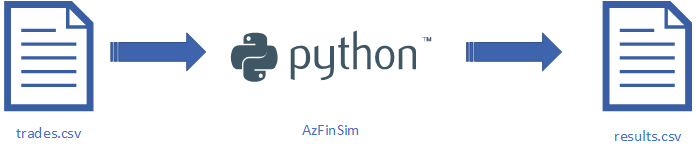

# bacc: the Azure *B*atch *Acc*elerator

[Azure Batch](https://learn.microsoft.com/en-us/azure/batch/batch-technical-overview)
is a service for running compute intensive workloads on Azure. It is a managed service for running
jobs on a pool of compute nodes. The service is designed to be highly scalable and can be used to run jobs that
require hundreds or thousands of compute nodes. The service is also designed to be highly customizable and can be
used to run a wide variety of workloads. Getting started with Azure Batch is easy. The service can be used to run jobs
in a matter of minutes. Getting a proof-of-concept (POC) that demonstrates the value of the service is relatively easy.
However, taking that POC to a production deployment can be challenging especially if the deployment needs to follow
best practices and security guidelines.
Despite best intentions, it's not uncommon that initial designs for POCs often end up being used for production deployments.
Given that, it is best to start with a system architecture that takes this into consideration.

These are exactly the scenarios that  **bacc** is designed to address. It is designed to make it easier to develop and
deploy Azure Batch based computing infrastructure in a manner that follows best practices and security guidelines.
This is part of our accelerator solution for Azure Batch intended to accelerate development of POCs as well as
production deployments alike.

## bacc is not ...

Before we look at what **bacc** is, let's look at what it is not.

**bacc** *is not* a deployment of Azure resources in a specific configuration. Different use-cases require different
resources. For example, how many subnets to setup in a virtual network, how many storage accounts to use, etc.
**bacc** does not make any assumptions or prescribe any specific configuration.

**bacc** *does not* claim to handle every security scenario and industry best practices.
It is designed to be a starting point for creating secure deployments. It is not a one-size-fits-all solution.
It is designed to be customized for specific use-cases.

## bacc is ...

**bacc** is a configurable Bicep module that can be used to deploy resources in Azure. The resources
deployed and the specific configuration of those resources is controlled by the user-editable configuration files.

**bacc** includes several [`examples`] that demonstrate how to use the Bicep module to deploy different types of
Azure Batch based deployments. These examples are intended to be used as starting points for creating custom
deployments. The examples are designed to be simple enough to be used as-is for simple use-cases. The examples
cover a wide gamut of real world HPC scenarios that are well suited for Azure Batch.

**bacc** comes with its own CLI (command line interface) tool that is used to resize pools, submit jobs, etc. The CLI
tool is intended for illustration purposes. It demonstrates how to use the Azure Python SDK to interact with Azure Batch
for various tasks like job submission and monitoring.

## Getting Started / Tutorials

The easiest way to get started is to follow one of the step-by-step tutorials for demo applications
that are closest to your target use-cases. These tutorials will walk you through the process of deploying the resources
and then try the specific demos inspired by real-world use-cases.

Before trying out any of these tutorials, please make sure you have completed the
[environment setup](./tutorials/environment-setup.md).

### __AzFinSim__: synthetic financial risk calculations

[AzFinSim](https://github.com/utkarshayachit/azfinsim) is a Python-based financial risk calculation application. While
this demo application is designed with FSI use-cases in mind, it is generic enough to be used as a starting point for
any embarrassingly parallel / high-throughput workload. Essentially, if you have an application that reads a bunch of
input files, performs some computation on each input file, and writes the results to an output file, then this is the demo
application you want to look at. Same is true if instead of files, your application is reading/writing to a database or
some other data store. The following table lists the tutorials that take you through the process of deploying
and testing AzFinSim on Azure Batch in various configurations.

| Tutorial | Description |
| -------- | ----------- |
| [Linux with Containers](./tutorials/azfinsim-linux.md) | Simple setup using application containers on Linux compute nodes. The demo includes using public container registries, like [Docker Hub](https://hub.docker.com) or deploying and using a private [Azure Container Registry (ACR)](https://azure.microsoft.com/en-us/products/container-registry). |
| [Windows](./tutorials/azfinsim-windows.md) | Same as above except using start tasks for application deployment instead of using container images. Also, this uses pool with nodes running Windows as the OS.|

To dive into the details of how the AzFinSim application is setup to run in these tutorials, please refer to the
[understanding AzFinSim](./understanding-azfinsim.md) document. The document also discusses how to monitor the application
progress using various tools provided by Azure.

### Secured Batch: Reference deployment for FSI use-cases

[Secured Batch](./tutorials/azfinsim-in-secured-batch.md) is a reference architecture for running FSI workloads on Azure Batch.
This is a complete hub-n-spoke deployment that includes a secured Azure Batch environment with firewall, log analytics, etc.
This tutorial demonstrates how a FSI application like AzFinSim, can be deployed and used in a secured Azure Batch environment.

| Tutorial | Description |
| -------- | ----------- |
| [Secured Batch](./tutorials/azfinsim-in-secured-batch.md) | Setup using application containers on Linux compute nodes within a secured Azure Batch environment that includes a complete hub and spoke deployment with firewall, log analytics, etc. |

### vizer: 3D visualization of scientific data

This demo demonstrates how Azure Batch can be used to setup a web application that enables users to setup
interactive 3D visualizations for datasets. [vizer](https://github.com/utkarshayachit/vizer) is a ParaView/Python-based
web application for visualizing scientific datasets.
The following table lists the tutorials that take you through the process of deploying and testing vizer on Azure Batch
in various configurations.

| Tutorial | Description |
| -------- | ----------- |
| [vizer](./tutorials/vizer.md) | Simple setup using application containers on Linux compute nodes. The demo deploys [vizer-hub](https://github.com/utkarshayachit/vizer-hub) which can be used to browse and visualize datasets from a preexisting storage account.

### MPI Benchmarks: MPI benchmarks (Intel and OSU micro-benchmarks)

MPI (Message Passing Interface) is a standard for writing parallel applications that run on distributed memory systems.
Azure Batch enables a cloud-native MPI deployment that can be used to run MPI applications on Azure. The following table
lists the tutorials that take you through the process of deploying and testing MPI benchmarks on Azure Batch in various
configurations.

| Tutorial | Description |
| -------- | ----------- |
| [MPI Benchmarks on RHEL](./tutorials/mpi-benchmarks-rhel.md) | Simple setup using application containers on Linux compute nodes with RHEL 8. |

## Design and Implementation

To understand the design of this repository, please refer to the [design document](./design.md). The implementation
uses user-editable configuration files that can be used to customize the deployments. These are also described in the
[design document](./design.md#configuration-files).

## Command-line Interface (CLI)

To make it easier to try out the demo applications, we have developed a custom command-line interface (CLI). The CLI
is described in the [CLI documentation](./cli.md). The [CLI][cli] also demonstrates how you can put together custom tools
to model your own workflows using Python and the [Azure Python SDK](https://learn.microsoft.com/en-us/azure/developer/python/?view=azure-python).

## Automated Testing (CI)

We use GitHub Actions to run automated tests on every pull request and/or change to the repository. For details on the
workflows and tests, please refer to the [testing document](./testing.md).

## License

Copyright (c) Microsoft Corporation. All rights reserved.

Licensed under the [MIT License](./LICENSE)

[cli]: https://github.com/utkarshayachit/azbatch-starter/tree/main/cli
[config]: https://github.com/utkarshayachit/azbatch-starter/tree/main/config
[`examples`]: https://github.com/utkarshayachit/azbatch-starter/tree/main/examples
